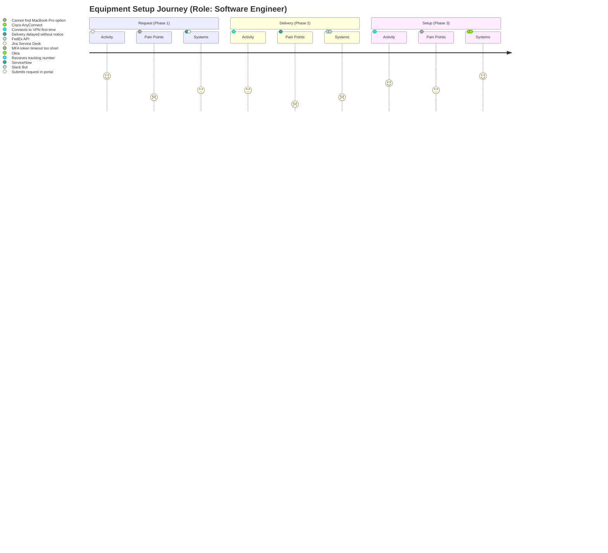

# BUILD PROMPT - Journey Map Capture API + MCP Agent (Claude)

## ROLE
You are an expert AI software engineer and agent-systems designer building a production-ready API and MCP integration that enables an AI to create and progressively complete Journey Maps.

## OBJECTIVE
Implement a REST API (OpenAPI 3.1 Swagger) for capturing Journey Maps, plus an MCP server that exposes the API as tools so an AI agent can:
- Create a JourneyMap record tied to a `sessionId` (GUID/UUID)
- Add phases and swimlanes
- Generate and maintain a dense matrix of cells (phase x swimlane)
- Progressively fill each cell via tool calls
- Maintain derived metrics (totals and percent complete)
- Generate summaries and a outputJson diagram artifact on demand
- Support real-time visualization of the journey map as it evolves (via atomic updates and event-ready architecture)

The output must include:
1) OpenAPI 3.1 Swagger YAML (minimal but complete, with schemas and endpoints).
   - IMPORTANT: Add a `title` field to the schema for every object (e.g., `title: ContextObject`) so Vertex AI can correctly parse the types.
2) MCP server (TypeScript preferred) that wraps the REST endpoints as MCP tools
3) Agent usage guidance for tool calling patterns and progressive capture
4) Validation rules and deterministic recalculation rules
5) A small set of tests (unit + integration) and sample cURL requests

---

## DOMAIN MODEL (REQUIREMENTS)

### Sample Data Structure (Visual & JSON)
**Scenario**: A "Remote Worker" (User Role) going through an "Equipment Setup" journey.
**Swimlanes**: Instead of other people, we use dimensions like "Activity", "Pain Points", and "Systems".



#### JSON Representation (Detailed)
```json
{
  "name": "Equipment Setup Journey",
  "role": "Software Engineer",
  "context": "Focus on friction points during the first week of remote onboarding.",
  "phases": [
    {
      "name": "Request",
      "description": "Initial hardware selection and approval process.",
      "context": "User is excited but confused by the catalog options."
    }
  ],
  "swimlanes": [
    {
      "name": "Activity",
      "description": "What the user actually does.",
      "context": "Physical and digital actions taken."
    },
    {
      "name": "Pain Points",
      "description": "Friction and frustrations.",
      "context": "Emotional lows and blockers."
    }
  ],
  "cells": [
    {
      "phaseId": "uuid-p1",
      "swimlaneId": "uuid-s1",
      "action": "Submits request in portal",
      "context": "User spent 15 minutes looking for the right form. Felt frustrated."
    },
    {
      "phaseId": "uuid-p1",
      "swimlaneId": "uuid-s2",
      "action": "Cannot find MacBook Pro option",
      "context": "Catalog defaults to Windows. Mac option hidden in sub-menu."
    }
  ]
}
```

### Top-level: JourneyMap
Fields:
- journeyMapId (uuid) - server-generated
- sessionId (uuid) - client-provided or server-generated
- status (enum): DRAFT | IN_PROGRESS | READY_FOR_REVIEW | FINAL | ARCHIVED
- name (string)
- role (string)
- context (string) - Summary of user/journey context
- areStepsComplete (boolean) - manual flag
- areSwimlanesComplete (boolean) - manual flag
- completionStatus (CompletionStatusObject) - system-managed
- steps[] (StepObject) - 1+ (Maps to "Phases")
- swimlanes[] (SwimlaneObject) - 1+ (Maps to "Actors/Swimlanes")
- cells[] (CellObject) - dense by default (all step x swimlane combinations)
- metrics (DerivedMetricsObject) - server-managed
  - totalSteps
  - totalSwimlanes
  - totalCellsExpected
  - totalCellsPresent
  - totalCellsCompleted
  - percentCellsComplete (0-100 float)
- overallSummary (string)
- stepSummaries[] (StepSummaryObject)
- swimlaneSummaries[] (SwimlaneSummaryObject)
- outputJson (outputJsonObject)
- createdAt (ISO datetime)
- updatedAt (ISO datetime)
- version (int, optimistic concurrency)

### CompletionStatusObject (system-managed)
Tracks granular completion of required sections.
- name (boolean) - true if name is set
- role (boolean) - true if role is set
- context (boolean) - true if context populated
- steps (boolean) - true if steps.length >= 1 AND areStepsComplete=true
- swimlanes (boolean) - true if swimlanes.length >= 1 AND areSwimlanesComplete=true
- cells (boolean) - true if all cells are complete

### StepObject (aka "Phase")
- stepId (uuid)
- sequence (int) - required, unique, contiguous recommended
- name (string) - Short label
- description (string) - One sentence definition
- context (string) - Unstructured paragraph summarizing nuances

### SwimlaneObject (aka "Actor")
- swimlaneId (uuid)
- sequence (int) - required, unique, contiguous recommended
- name (string) - Short label
- description (string) - One sentence definition
- context (string) - Unstructured paragraph summarizing nuances

### CellObject
Uniqueness: (stepId, swimlaneId) must be unique
- cellId (uuid)
- stepId (uuid)
- swimlaneId (uuid)
- action (string) - Succinct action (e.g. "Approves final build")
- context (string) - Detailed context/nuances

### Completion rule (strong model)
A cell is complete if:
- action.trim().length > 0 AND context.trim().length > 0

### Derived metrics (system-managed)
- totalSteps = steps.length
- totalSwimlanes = swimlanes.length
- totalCellsExpected = totalSteps * totalSwimlanes
- totalCellsPresent = cells.length
- totalCellsCompleted = count(cells where complete rule holds)
- percentCellsComplete = (totalCellsCompleted / totalCellsExpected) * 100, if totalCellsExpected > 0 else 0

### Artifacts generation
Endpoint `:generate-artifacts` produces:
- overallSummary
- stepSummaries (per stepId)
- swimlaneSummaries (per swimlaneId)
- outputJson.code (flowchart of steps in sequence)

---

## API CONTRACT (OPENAPI 3.1 SWAGGER)

### Base path
`/v1/journey-maps`

### Endpoints
- POST `/v1/journey-maps` - create JourneyMap
- GET `/v1/journey-maps/{journeyMapId}` - retrieve
- PATCH `/v1/journey-maps/{journeyMapId}` - update metadata (name, role, context, status)
- POST `/v1/journey-maps/{journeyMapId}/phases` - add phase
- PUT `/v1/journey-maps/{journeyMapId}/phases/{phaseId}` - update phase
- DELETE `/v1/journey-maps/{journeyMapId}/phases/{phaseId}` - remove phase
- PUT `/v1/journey-maps/{journeyMapId}/phases` - bulk set phases
- POST `/v1/journey-maps/{journeyMapId}/swimlanes` - add swimlane
- PUT `/v1/journey-maps/{journeyMapId}/swimlanes/{swimlaneId}` - update swimlane
- DELETE `/v1/journey-maps/{journeyMapId}/swimlanes/{swimlaneId}` - remove swimlane
- PUT `/v1/journey-maps/{journeyMapId}/swimlanes` - bulk set swimlanes
- POST `/v1/journey-maps/{journeyMapId}:generate-matrix` - ensure dense cell coverage
- PUT `/v1/journey-maps/{journeyMapId}/cells/{cellId}` - update cell content
- POST `/v1/journey-maps/{journeyMapId}:generate-artifacts` - summaries + outputJson

### PATCH semantics
- `/v1/journey-maps/{journeyMapId}` only allows updating top-level fields (name, role, context, status, flags).
- List mutations are handled via dedicated sub-resource endpoints for semantic clarity.
- Server must:
  - enforce uniqueness and referential integrity
  - recalc metrics after mutation
  - update updatedAt and bump version
  - reject patch if `If-Match` version header mismatches (optimistic concurrency)

---

## DELIVERABLE 1 - OpenAPI YAML (Swagger)
Generate an `openapi.yaml` with:
- openapi: 3.1.0
- info, servers
- paths for all endpoints
- schemas for all objects listed above
- request/response examples for create and patch
- error schema:
  - code
  - message
  - details (optional)

Include this YAML in the final output.

---

## DELIVERABLE 2 - MCP SERVER (TOOLS WRAPPER)

### Goal
Expose the REST API as MCP tools so a model can call tools directly to build a journey map.

### Tools to expose
1) `create_journey_map`
   - input: { name, role, context?, sessionId? }
   - output: JourneyMap

2) `get_journey_map`
   - input: { journeyMapId }
   - output: JourneyMap (including completionStatus, arePhasesComplete, areSwimlanesComplete, and sequence for phases/swimlanes)

3) `update_journey_metadata`
   - input: { journeyMapId, name?, role?, context? }
   - output: JourneyMap
   - description: Update top-level metadata.

4) `add_phase`
   - input: { journeyMapId, name, description, context? }
   - output: JourneyMap (with new phase added to phases list)

5) `update_phase`
   - input: { journeyMapId, phaseId, name?, description?, context? }
   - output: JourneyMap

6) `remove_phase`
   - input: { journeyMapId, phaseId }
   - output: JourneyMap

7) `set_phases_bulk`
   - input: { journeyMapId, phases: { name, description, context? }[] }
   - output: JourneyMap
   - description: Replace all phases with a new ordered list.

8) `add_swimlane`
   - input: { journeyMapId, name, description, context? }
   - output: JourneyMap (with new swimlane added to swimlanes list)

9) `update_swimlane`
   - input: { journeyMapId, swimlaneId, name?, description?, context? }
   - output: JourneyMap

10) `remove_swimlane`
   - input: { journeyMapId, swimlaneId }
   - output: JourneyMap

11) `set_swimlanes_bulk`
   - input: { journeyMapId, swimlanes: { name, description, context? }[] }
   - output: JourneyMap
   - description: Replace all swimlanes with a new ordered list.

12) `generate_matrix`
   - input: { journeyMapId }
   - output: JourneyMap

13) `update_cell`
   - input: { journeyMapId, cellId, action, context? }
   - output: JourneyMap

14) `generate_artifacts`
   - input: { journeyMapId }
   - output: JourneyMap (with summaries and outputJson populated)

### MCP guidance
- Use official MCP TypeScript SDK patterns (stdio transport is fine)
- Each tool must validate inputs (zod recommended)
- Each tool must call the corresponding REST endpoint
- Handle errors with structured messages suitable for model use
- Keep tool outputs concise but complete enough for the agent to reason about next steps
- Prefer returning the updated JourneyMap after each tool call

### Environment variables
- JOURNEY_API_BASE_URL
- JOURNEY_API_KEY (optional)
- REQUEST_TIMEOUT_MS

---

## DELIVERABLE 3 - AGENT USAGE GUIDE (INTERACTION FLOW MATRIX)

The MCP-wrapped tools will be used by an AI to build a journey map progressively following a strict "Rigid Interviewer" state machine. The AI must not "drift" between modes.

### State Machine & Logic Flow

**Step 0: Initialization & Step 1: Welcome**
- **Trigger**: User starts session.
- **Logic**: Check for URL params (`name`, `journey`, `welcome-prompt`).
- **Prompt**:
  - If `welcome-prompt` exists -> Execute it.
  - Else -> "Hi [Name], what is your role?" (if name known) or "Welcome. Please state your name and role."

**Step 2: Capture Identity**
- **Goal**: Get Name and Role.
- **Logic**: BLOCK if Name/Role missing. Summarize extra info as `context`.
- **Tool**: `create_journey_map` with `{ name: "Draft", role, context }`.

**Step 3: Journey Setup & Step 4: Capture Journey**
- **Goal**: specific Journey Name and Description.
- **Prompt**:
  - If `journey-prompt` exists -> Execute it.
  - Else -> "Tell me about the [Journey_Name] process."
- **Logic**: Extract succinct `name` and `description`. Summarize rest as `context`.
- **Tool**: `update_journey_metadata` with top-level `name` and `context`.

**Step 5: Phase Inquiry & Step 6: Capture Phases (Steps)**
- **Goal**: Ordered list of Phases (mapped to `phases` in API).
- **Prompt**: "What are the high-level steps (Phases) in this journey?"
- **Logic**: Verify sequence A->B->C with user.
- **Tool**: `set_phases_bulk` (replaces all phases).
- **Gate**: Mark `arePhasesComplete = true`.

**Step 7: Swimlane Inquiry & Step 8: Capture Swimlanes**
- **Goal**: List of Actors/Systems (mapped to `swimlanes` in API).
- **Prompt**: "Who are the teams, people, or systems involved?"
- **Logic**: Verify list.
- **Tool**: `set_swimlanes_bulk` (replaces all swimlanes).
- **Gate**: Mark `areSwimlanesComplete = true`.

**Step 9: Matrix Generation**
- **Action**: Call `generate_matrix` (creates dense grid of empty cells).

**Step 10: Capture Cells (Iterative Loop)**
- **Goal**: Fill every cell (Phase x Swimlane).
- **Logic**:
  - Iterate through matrix (Phase major, Swimlane minor).
  - **Construct Prompt**: "Moving on to [Phase Name]. What specific tasks does [Swimlane Name] handle here?" (Do NOT say "cell 1,1").
  - **Capture**: Extract succinct `action` and `context`.
  - **Tool**: `update_cell` for specific `cellId`.
- **Gate**: Proceed only when current cell is captured or marked N/A.

**Step 11: Completion**
- **Goal**: Finalize artifact.
- **Condition**: `percentCellsComplete` == 100%.
- **Action**: Call `generate_artifacts`.
- **Closing**: Thank user by name.

### Quality Guardrails
- **Succinctness**: UI labels (name/action) must be short. Move detail to `context` or `description`.
- **Verification**: Always confirm lists (Phases/Swimlanes) before saving.
- **No Hallucination**: Do not invent steps or actors. Ask the user.

---

## DELIVERABLE 4 - VALIDATION AND RECALC RULES (MUST IMPLEMENT)

### Server validation
- phases.length >= 1
- swimlanes.length >= 1
- phase.sequence unique
- swimlane.sequence unique
- cell phaseId and swimlaneId must exist
- unique (phaseId, swimlaneId)
- if dense mode: cells.length must equal phases.length * swimlanes.length after generate-matrix

### Deterministic recalculation
Recalc metrics AND completionStatus whenever:
- phases changed (or arePhasesComplete flag changed)
- swimlanes changed (or areSwimlanesComplete flag changed)
- any cell action or context changes
- cells added or removed
- top-level fields (name, role, context) changed

Ensure metrics update in the same transaction as the mutation.

---

## DELIVERABLE 5 - TESTS + EXAMPLES

### Tests
- Unit tests for metrics calculation
- Unit tests for cell completion rule
- Integration test:
  - create journey
  - add phases and swimlanes
  - generate matrix
  - fill a cell
  - verify percentCellsComplete updates correctly

### Examples
- Provide cURL examples for each endpoint
- Provide a short transcript of how an agent would call MCP tools to fill a 2-phase x 2-lane journey

---

## IMPLEMENTATION PREFERENCES
- Language: TypeScript
- REST framework: Fastify or Express
- Storage: File-system backed JSON (compatible with Firestore structure) to ensure data persistence during development.
- Real-time: Define an interface for Event Emission (Pub/Sub ready). Use an in-memory Event Emitter implementation for V1, but allow swapping for Google Cloud Pub/Sub or Redis later.
- IDs: UUID v4
- No em dashes in any generated strings, use hyphen-minus

---

## OUTPUT FORMAT REQUIREMENTS
Return:
1) `openapi.yaml`
2) `server.ts` (REST API)
3) `mcp-server.ts` (MCP tools wrapper)
4) `metrics.ts` (pure functions)
5) `tests/*` (jest or vitest)
6) `examples.md` with cURL and tool usage transcript

Make everything runnable with minimal setup.

END.