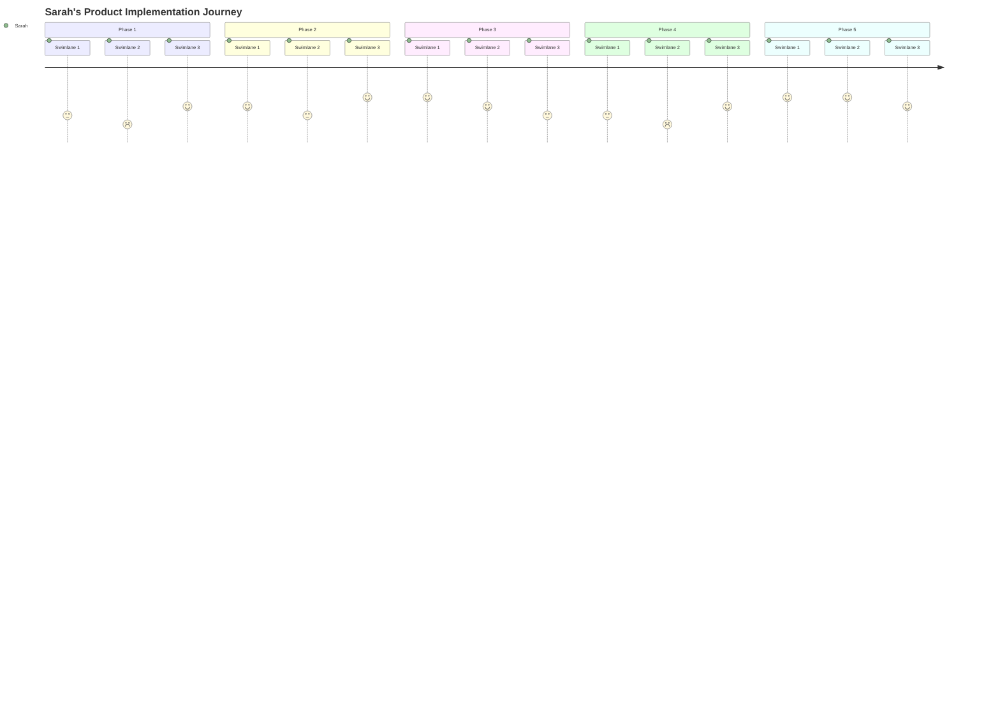

# User Journey Map Example

## Journey Overview

**User Name:** Sarah Chen
**Role:** Product Manager
**Summary:** Sarah's journey through the product discovery and implementation process, from initial research to successful deployment.
## Phase Summary

- **Phase 1:** Initial research and problem identification
- **Phase 2:** Solution exploration and vendor evaluation
- **Phase 3:** Decision making and procurement
- **Phase 4:** Implementation and integration
- **Phase 5:** Adoption and optimization
## Step Summary

The journey consists of 15 key touchpoints across 5 phases, involving interactions with multiple teams and systems. Each phase builds upon the previous one, moving from discovery through implementation to ongoing optimization.
## Journey Map


## ertex AI Driver Specification: Journey Mapping Assistant

**Version:** 1.0
**Purpose:** Documentation for the Prompt Engineering and Orchestration Logic of the Journey Mapping Agent.
## 1. Interaction Flow Matrix

This matrix defines the strict state machine for the AI driver. The conversation moves linearly; the AI is prohibited from advancing to the next stage until the current stage's "Gate Criteria" are met and the relevant MCP tool has been successfully executed.

| **Step** |       **State**       |          **User Interaction**          |                                                                                                               **AI Driver Logic (The Brain)**                                                                                                                |                                **API/MCP Operations (The Hands)**                                 |
|----------|-----------------------|----------------------------------------|--------------------------------------------------------------------------------------------------------------------------------------------------------------------------------------------------------------------------------------------------------------|---------------------------------------------------------------------------------------------------|
| **0**    | **Initialization**    | User triggers the WebUI via URL.       | **Context Analysis:**1. Parse URL parameters.2. **Logic Branch:**• If `welcome-prompt` exists, inject into context.• If `journey-prompt` exists, inject into context.• If `name` or `journey` encoded, store in ephemeral memory.                            | `session.init(url_params)`(Logs session start)                                                    |
| **1**    | **Welcome**           | User reads opening message.            | **Prompt Generation:**• **Scenario A (Custom):** If `welcome-prompt` param exists, execute it.• **Scenario B (Known Name):** "Hi `[Name]`, what is your role?"• **Scenario C (Default):** "Welcome. Please state your name and role."                        | No write action.                                                                                  |
| **2**    | **Capture Identity**  | **User provides Name & Role.**         | **Gatekeeper:**• Extract `Name` and `Role`.• Summarize remaining text as `Context`.• **BLOCK:** If Name/Role is missing, re-prompt. Do not proceed.• If valid, call MCP.                                                                                     | `mcp.create_user({``name: string,``role: string,``context: string``})`                            |
| **3**    | **Journey Setup**     | **User describes the job/process.**    | **Prompt Generation:**• **Scenario A (Custom):** If `journey-prompt` param exists, execute it.• **Scenario B (Known Journey):** "Tell me about the `[Journey_Name]` process."• **Scenario C (Default):** "Describe an important end-to-end job you perform." | No write action.                                                                                  |
| **4**    | **Capture Journey**   | **User elaborates on the process.**    | **Gatekeeper:**• Extract `Journey_Name` (succinct title) and `Description`.• Summarize remaining details as `Journey_Context`.• **BLOCK:** Ensure Name and Description are distinct.                                                                         | `mcp.create_journey({``name: string,``desc: string,``context: string``})`                         |
| **5**    | **Phase Inquiry**     | **User lists the steps (Phases).**     | **Investigation:**• Ask for the sequential high-level steps.• Probe for specific context on each phase.• **Verification:** AI must read back the sequence (A→B→C) and ask "Is this order correct?"                                                           | No write action.                                                                                  |
| **6**    | **Capture Phases**    | **User confirms phase sequence.**      | **Gatekeeper:**• Extract ordered list of phases.• **BLOCK:** Do not save until user confirms the completesequence.• Once confirmed, call MCP.                                                                                                                | `mcp.save_phases([{``name: string,``desc: string,``context: string``}])`                          |
| **7**    | **Swimlane Inquiry**  | **User lists the actors (Swimlanes).** | **Investigation:**• Ask for the teams/people/systems involved.• Use known Phases to jog memory (e.g., "Who handles the [Phase 1 Name]?").• **Verification:** Read back the list of actors for confirmation.                                                  | No write action.                                                                                  |
| **8**    | **Capture Swimlanes** | **User confirms swimlane list.**       | **Gatekeeper:**• Extract list of Swimlanes.• **BLOCK:** Do not save until user confirms the list is complete.• Once confirmed, call MCP.                                                                                                                     | `mcp.save_swimlanes([{``name: string,``desc: string,``context: string``}])`                       |
| **9**    | **Cell Generation**   | User prepares to answer specifics.     | **Logic:**• The AI internally generates a grid: `Phases` (cols) × `Swimlanes` (rows).• **Prompt Construction:** For every empty cell, generate a natural language question: "In [Phase Name], what actions does [Swimlane Name] take?"                       | Internal Loop Start                                                                               |
| **10**   | **Capture Cells**     | **User details specific actions.**     | **Iterative Loop & Gatekeeper:**• Ask the generated question.• Probe once for additional context/nuance.• Extract `Cell_Action` (succinct) and `Cell_Context`(summary).• **BLOCK:** Do not move to next cell until current is captured (or marked N/A).      | `mcp.save_cell({``phase_id: string,``swimlane_id: string,``content: string,``context: string``})` |
| **11**   | **Completion**        | **User receives closing.**             | **Finalize:**• Check that all cells in the matrix are addressed.• Thank the user by `Name`.                                                                                                                                                                  | `mcp.finalize_journey()``session.close()`                                                         |


---
## Implementation Notes for Vertex AI Driver

### A. System Prompt "State Machine"

The System Prompt must define the AI as a "Rigid Interviewer" that operates in distinct modes. The AI should not be allowed to "drift" between modes.
- **Mode 1: Identification** (Get Name/Role).
- **Mode 2: Structural Definition** (Get Lists of Phases and Swimlanes).
- **Mode 3: Matrix Population** (Fill the cells).
**Prompt Instruction Snippet:**
> "You are the Journey Mapper. You do not hallucinate data. You do not proceed to the next step until the current step's data is captured via the defined Tool. If the user provides a long paragraph, your job is to extract the 'Succinct Name' for the database and summarize the rest as 'Context'."
### B. URL Parameter Logic

The driver must handle the injection of URL variables into the immediate context window before the first token is generated.
- param: name → Sets variable $USER_NAME.
- param: journey → Sets variable $JOURNEY_NAME.
- param: welcome-prompt → **Overrides** standard greeting logic. The AI must execute this string as its first instruction.
- param: journey-prompt → **Overrides** standard journey inquiry. The AI uses this string when transitioning from Step 2 to Step 3.
### C. The "Natural Language" Cell Prompt

In **Step 10**, the AI must not say "Fill cell 1,1." It must dynamically construct a conversational question.
- *Variable A:* Phase_Name (e.g., "Product Launch")
- *Variable B:* Swimlane_Name (e.g., "Legal Team")
- *Derived Prompt:* "Moving on to the **Product Launch**. What specific tasks does the **Legal Team** handle during this stage?"
### D. MCP Payload Structures

The Model Context Protocol (MCP) definitions must support two distinct text fields for every entity to ensure the UI can display clean labels while retaining rich AI data.
**1. Journey/Phase/Swimlane Objects:**
JSON
```plaintext
{
  "name": "Short label for UI (e.g., 'QA Testing')",
  "description": "One sentence definition.",
  "context": "Unstructured paragraph summarizing user's nuances, complaints, or extra details."
}

```
**2. Cell Objects:**
JSON
```plaintext
{
  "coordinates": { "phase": "Phase_ID", "swimlane": "Swimlane_ID" },
  "action": "Succinct action (e.g., 'Approves final build')",
  "context": "Detailed context (e.g., 'Process is often delayed here due to timezone differences.')"
}
```


1. The user goes to the Chat UI and is welcomed BY THE AI asking them for their name and role.
	
	- If a name is encoded on the URL string that opens WebUI the name of the person is known.
	
		- If a JOURNEY is encoded on the URL string that opens WebUI the Journey Name is known.
	
	- If a "welcome-prompt" is sent along with the URL string then this prompt is used to generate the first message versus the default welcome message generation prompt.
	
	Example of a default welcome prompt "Greet the user ask for their name and role"
	
	Example of a custom welcome prompt "Greet the user by name and ask what they do for Coca-Cola"
	

2. The NAME, ROLE are captured by the AI via the MCP succinctly in a new journey. Summarize anything else as CONTEXT. The AI does not let the conversation proceed until the NAME and ROLE is known. (this new journey is associated with a session)


3. The AI then asks about the JOURNEY. 

	- If a "JOURNEY" is sent along with the URL string then this prompt is used to generate this message:
	
	Example of a default JOURNEY prompt "Ask the user for an important end-to-end job they perform."
	
	Example of a custom JOURNEY prompt "Ask the user to elaborate on their marketing process from product ideation to product launch"
	 
	
	5. The JOURNEY name is captured by the AI via the MCP succinctly. Summarize anything else as CONTEXT. The AI does not let the conversation proceed until the JOURNEY is named and described succinctly.
	
 
 6. The AI then asks about the PHASES on the journey - each phase has a name, succint description, and context. 
	
	The AI must understand each phase, probe each for context, and make sure the sequence is correct. The AI must confirm with the user a complete sequence just based on name alone before proceeding. 
	
	
7. The PHASES are captured by the AI via the MCP succinctly in the new journey. Summarize anything else as CONTEXT. The AI does not let the conversation proceed until the PHASES are known.  
	
	
8. The AI then asks about the SWIMLANES on the journey - each SWIMLANE has a name, succint description, and context. 
	
	The AI must understand each SWIMLANE, probe each for context, and make sure the sequence is correct. The AI must confirm with the user a complete sequence just based on name alone before proceeding. It's OK to reference a PHASE to guide the questions. 	
	
9. The SWIMLANES are captured by the AI via the MCP succinctly. Summarize anything else as CONTEXT. The AI does not let the conversation proceed until the SWIMLANES are known. 
	
	
10. Once the SWIMLANES and PHASES are known each CELL created must be filled by a natural langauge prompt created by taking the SWINLANE and PHASE name and description derived prompt that naturally asks what happens here and probes once for additional context.

11. The CELLS are captured by the AI via the MCP succinctly in the journey. Summarize anything else as CONTEXT. The AI does not let the conversation proceed until the CELLS are known. 

12. Once all the CELLS are captured thanks the user for their time and by name.


	
	
	
	
	
	
	
	
	
	
	
	
	


